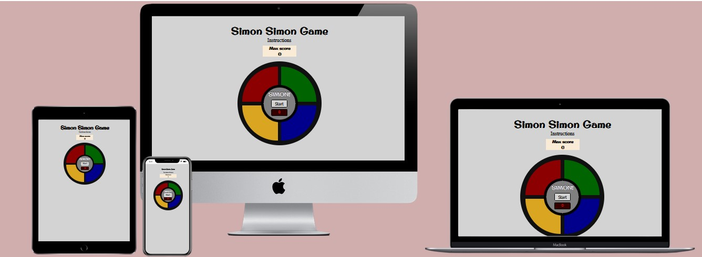
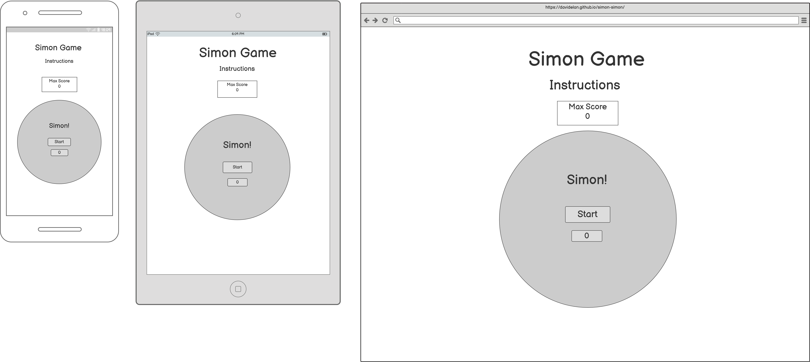
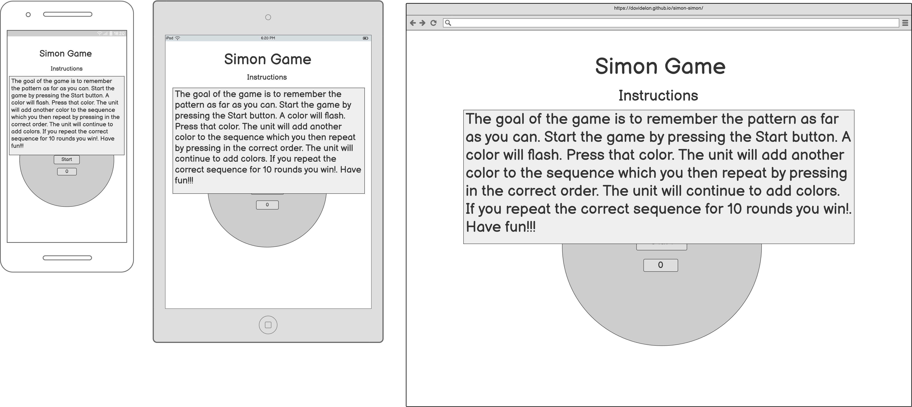
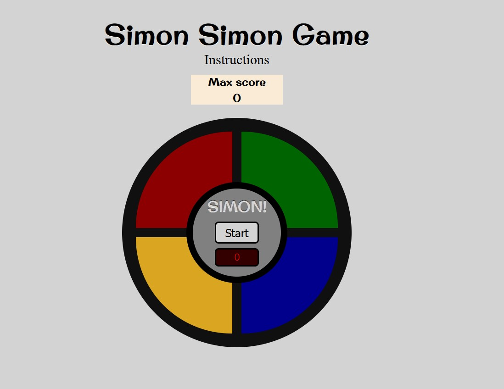

# Simon Game

_Javascript Essentials Project Portfolio - Code Institute_

View deployed site [here.](https://davidelan.github.io/simon-game/)

Simon Game is a game for children and adults. It was intended as a tool to improve memory and to have fun.
The original game was a physical game, a console game. 
"Simon is an electronic game of short-term memory skill invented by Ralph H. Baer and Howard J. Morrison, working for toy design firm Marvin Glass and Associates,[1] with software programming by Lenny Cope. The device creates a series of tones and lights and requires a user to repeat the sequence. If the user succeeds, the series becomes progressively longer and more complex ... " source: [Wikipedia](https://en.wikipedia.org/wiki/Simon_(game)).
In this version, if the player reaches a certain number of rounds, he/she wins and the game ends. 

## Table of contents

- [User Experience (UX)](#user-experience)
- [Design](#design)
- [Features](#features)
- [Technologies Used](#technologies-used)
- [Testing](#testing)
- [Deployment](#deployment)
- [Credits](#credits)

## User Experience (UX)

### User stories

This game is good for kids who need help with:

-**Working Memory:** 

***Recalling and retaining information while working.***

Requiring players to memorize an ever-increasing sequence of colors and sounds, Classic Simon is a great game for practicing Working Memory. The game is played in a simple, four color mode. The sequence repeats and builds on itself, requiring players to memorize and increasingly complex sequence of colors and sounds.

-**Focus:** 

***Getting started and then maintaining attention and effort to tasks.***

The game Simon, which tasks players with paying close attention the sequences of color and sound, are great for practicing Focus skills. Players need to pay attention to the way the colors correspond with the tones, as doing so will make memorizing each sequence all the easier.

This game is good for rehabilitation for stroke patients:

-**Rehabilitation:** 

The Simon game is a fun, inexpensive, and engaging exercise to improve memory and brain function after stroke or brain injury.

Using colored blocks, lights, and sounds as directional prompts, the Simon game engages cognitive function that works on sequential processing, short-term memory, attention and visual processing.

-**Suitability:** 

The game is suitable for all ages. Adults supervision advised for children under 4 years old.

## Design

- **Imagery:**
  The images that make up the game are crated with the combination of html divs and css styling. No external image was used in the project.
- **Colour Scheme:**
  The colors of the console have been chosen according to the colors of the real Simon game. The background color was set to "lightgray" which I considered to be an appropriate contrast color for the colorful game.  

* I have used `lightgray` as the background color.

* I have used `darkred` and `tomato` as the red color of the game console.
* I have used `darkgreen` and `lightgreen` as the green color of the game console.
* I have used `goldenrod` and `yellow` as the yellow color of the game console.
* I have used `darkblue` and `lightskyblue` as the blue color of the game console.

* I have used `gray` as the background color of the inner circle of the console game.

* I have used `antiquewhite` as the background color for the Max Score and the Instructions.
  

- **Typography:**
  [Original Surfer + emboss effect](https://fonts.googleapis.com/css?family=Original+Surfer&effect=emboss) was used for the title of the page, the Max Score section and for the name of the game in the middle of the console.
  The standard [Courier] font was used to display the number in the counter display in the middle of the game. 
  

### Wireframes

Wireframes were created for mobile, tablet and desktop using balsamiq.

Home page:

with instructions:

### Features

The website is comprised of a single home page in which the game takes place, the highest score, the number of runs and the state (win or over) are displayed and the instructions can be viewed (by clicking on the "Instructions").

The main website is responsive and have:

* A favicon in the browser tab.

  

#### The Home Page

The home page is the place that contains all the features of the game. In it there are the main game console with the different colors, the title, the instructions (clickable), the counter with the highest score 

The home page of The Quiz Arms displays the sites name as a title and then a container which holds some welcome text, including alerting the users that they can navigate back to the home page at any time by clicking on the page name. Below this are three buttons, how to play, play and high scores.

