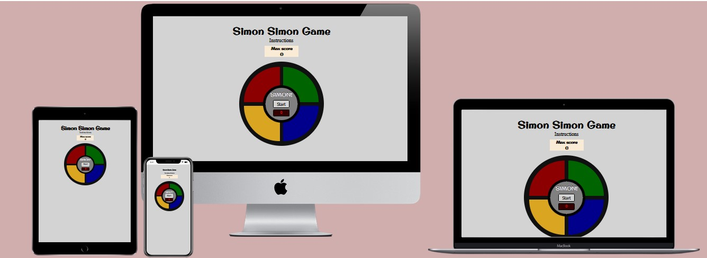
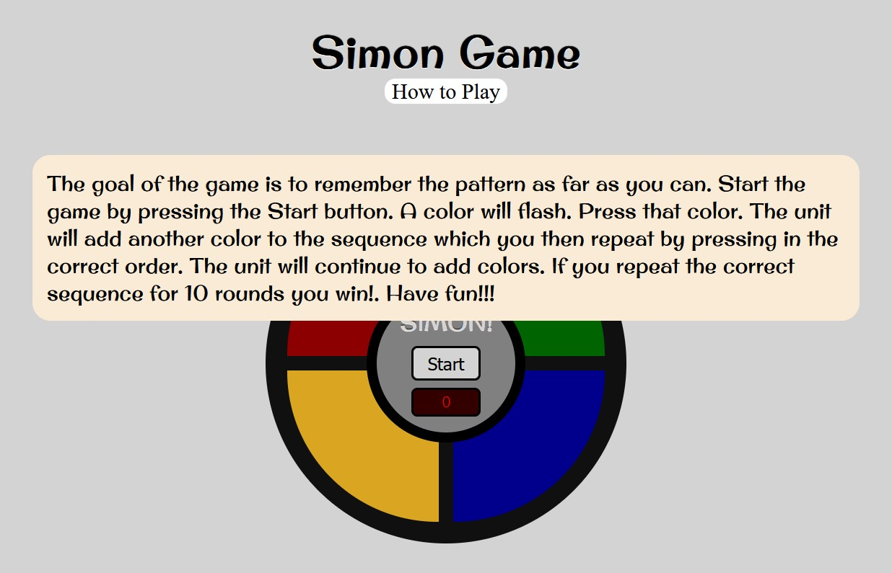

# Simon Game

_Javascript Essentials Project Portfolio - Code Institute_

View deployed site [here.](https://davidelan.github.io/simon-game/)

Simon Game is a game for children and adults. It was intended as a tool to improve memory and to have fun.
The original game was a physical game, a console game. 
"Simon is an electronic game of short-term memory skill invented by Ralph H. Baer and Howard J. Morrison, working for toy design firm Marvin Glass and Associates,[1] with software programming by Lenny Cope. The device creates a series of tones and lights and requires a user to repeat the sequence. If the user succeeds, the series becomes progressively longer and more complex ... " source: [Wikipedia](https://en.wikipedia.org/wiki/Simon_(game)).
In this version, if the player reaches a certain number of rounds, he/she wins and the game ends.  

## Table of contents

- [User Experience (UX)](#user-experience)
- [Design](#design)
- [Features](#features)
- [Technologies Used](#technologies-used)
- [Testing](#testing)
- [Deployment](#deployment)
- [Credits](#credits)

## User Experience (UX)

### User stories

This game is good for kids who need help with:

-**Working Memory:** 

***Recalling and retaining information while working.***

Requiring players to memorize an ever-increasing sequence of colors and sounds, Classic Simon is a great game for practicing Working Memory. The game is played in a simple, four-color mode. The sequence repeats and builds on itself, requiring players to memorize an increasingly complex sequence of colors and sounds.

-**Focus:** 

***Maintaining attention and effort to tasks.***

The game Simon, which tasks players with paying close attention to the sequences of color and sound, is great for practicing Focus skills. Players need to pay attention to the way the colors correspond with the tones, as doing so will make memorizing each sequence all the easier.

This game is good for rehabilitation for stroke patients:

-**Rehabilitation:** 

The Simon game is a fun, inexpensive, and engaging exercise to improve memory and brain function after stroke or brain injury.

Using colored blocks, lights, and sounds as directional prompts, the Simon game engages cognitive functions that works on sequential processing, short-term memory, attention and visual processing.

-**Suitability:** 

The game is suitable for all ages. Adults supervision advised for children under 4 years old.

## Design

- **Imagery:**
  The images that make up the game are created with the combination of html divs and css styling. No external image was used in the project.
- **Colour Scheme:**
  The colors of the console have been chosen according to the colors of the real Simon game. The background color was set to "lightgray" which I considered to be an appropriate contrast color for the colorful game.  

* I have used `lightgray` as the background color.

* I have used `darkred` and `tomato` as the red color of the game console.
* I have used `darkgreen` and `lightgreen` as the green color of the game console.
* I have used `goldenrod` and `yellow` as the yellow color of the game console.
* I have used `darkblue` and `lightskyblue` as the blue color of the game console.

* I have used `gray` as the background color of the inner circle of the console game.

* I have used `antiquewhite` as the background color for the Max Score and the Instructions. 

- **Typography:**
  [Original Surfer + emboss effect](https://fonts.googleapis.com/css?family=Original+Surfer&effect=emboss) was used for the title of the page, the Max Score section and for the name of the game in the middle of the console.
  The standard [Courier] font was used to display the number in the counter display in the middle of the game. 
  

### Wireframes

Wireframes were created for mobile, tablet and desktop using balsamiq.

### Features

The website consists of a single home page in which the game takes place, the highest score, the number of runs and the state (win or over) are displayed and the instructions can be viewed (by clicking on the "Instructions").

The main website is responsive and has:

* A favicon in the browser tab.

  

#### The Home Page

The home page is the place that contains all the features of the game. In it there are the main game console with the Play button, the different game color sections, the title, the "How to Play" (clickable), the counter with the highest score. 

When clicking on "How to play", a window (with the game instructions) inside the main page is displayed.
 

 

In the same main page, the game can be started and according to the performance of the player, win or lose. 

### Future Implementations

1. It would be nice to implement an option for the players to choose after how many rounds they can win the game. An option to input the number would, therefore, be nice. 
2. Maybe also nice would be to give the option to the user to enter their name and display on the screen.
3. So far the only way to close the "How to Play" window is to click again on the text. It would be nicer to also have a button in the How-to description to close it from there.
3. If the Play button is pressed in the middle of the game, the game starts from scratch. It would be nice to disable the Play button for the whole duration of the game (although my girlfriend said she likes that she can restart at any time :-) 

### Accessibility

I have been mindful during coding to ensure that the website is as accessible friendly as possible. This has been have achieved by:

* Using semantic HTML.
* Using a hover state on all buttons on the site to make it clear to the user if they are hovering over a button.
* Ensuring that there is a sufficient colour contrast throughout the site.

In a future implementation I think it would be a great accessibility feature to also add a symbol such as a tick or cross on the answer button to enable people who are colour blind to also be able to play the game.

## Technologies Used

### Languages Used

HTML, CSS, Javascript

### Frameworks, Libraries & Programs Used

- [HTML5](https://en.wikipedia.org/wiki/HTML5)
- [CSS3](https://en.wikipedia.org/wiki/Cascading_Style_Sheets)
- [JavaScript](https://en.wikipedia.org/wiki/JavaScript) 
- [Google Fonts](https://fonts.google.com/) was used to import fonts into the html file.
- [Git](https://git-scm.com/) was used for version control by utilizing the Gitpod terminal to commit to Git and Push to GitHub.
- [GitPod](https://gitpod.io/) - IDE used to create the site.
- [GitHub](https://github.com/) was used to save and store the files for the website.
- [Balsamiq](https://balsamiq.com/) was used to design the wireframes.
- [Am I Responsive](https://ui.dev/amiresponsive) was used to display the website on different devices.
- [LanguageTool](https://languagetool.org/) was used to check the grammar and spelling in the README.

## Deployment & Local Development

### Deployment

The site is deployed using GitHub Pages - [Simon Game](https://davidelan.github.io/simon-simon/).

To Deploy the site using GitHub Pages:

1. Login (or signup) to Github.
2. Go to the repository for this project, [davidelan/simon-simon](https://github.com/davidelan/simon-simon).
3. Click the settings button.
4. Select pages in the left hand navigation menu.
5. From the source dropdown select main branch and press save.
6. The site has now been deployed, please note that this process may take a few minutes before the site goes live.

### Local Development

#### How to Fork

To fork the repository:

1. Log in (or sign up) to Github.
2. Go to the repository for this project, [davidelan/simon-simon](https://github.com/davidelan/simon-simon)
3. Click the Fork button in the top right corner.

#### How to Clone

To clone the repository:

1. Log in (or sign up) to GitHub.
2. Go to the repository for this project, [davidelan/simon-simon](https://github.com/davidelan/simon-simon)
3. Click on the code button, select whether you would like to clone with HTTPS, SSH or GitHub CLI and copy the link shown.
4. Open the terminal in your code editor and change the current working directory to the location you want to use for the cloned directory.
5. Type 'git clone' into the terminal and then paste the link you copied in step 3. Press enter.

- - -